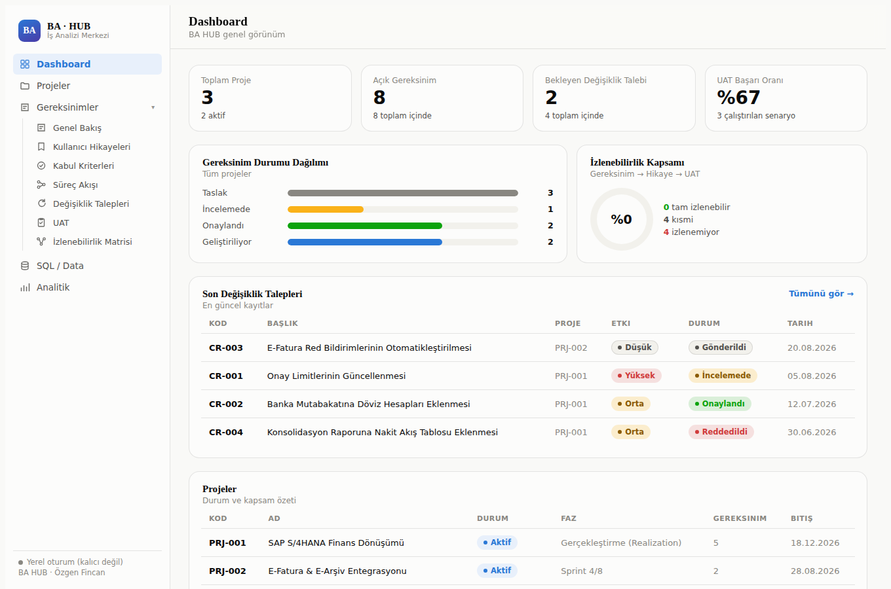
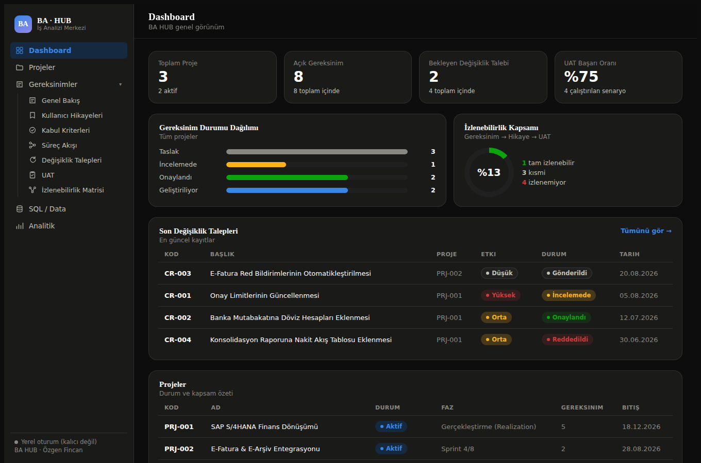
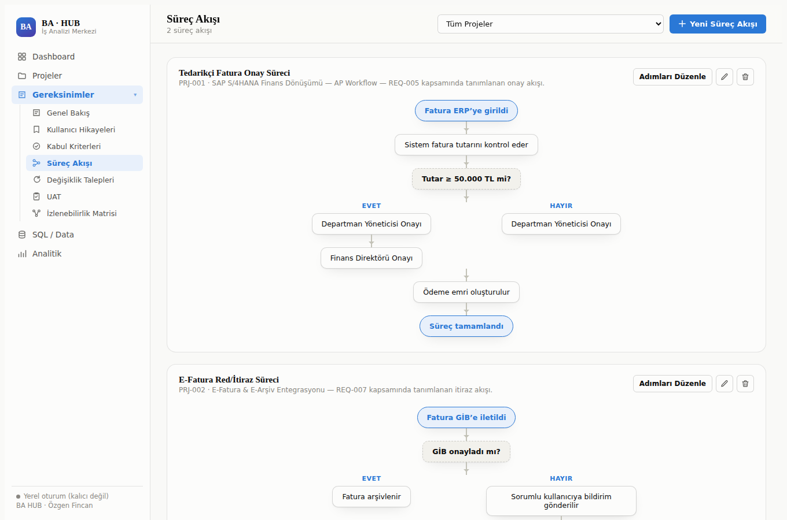
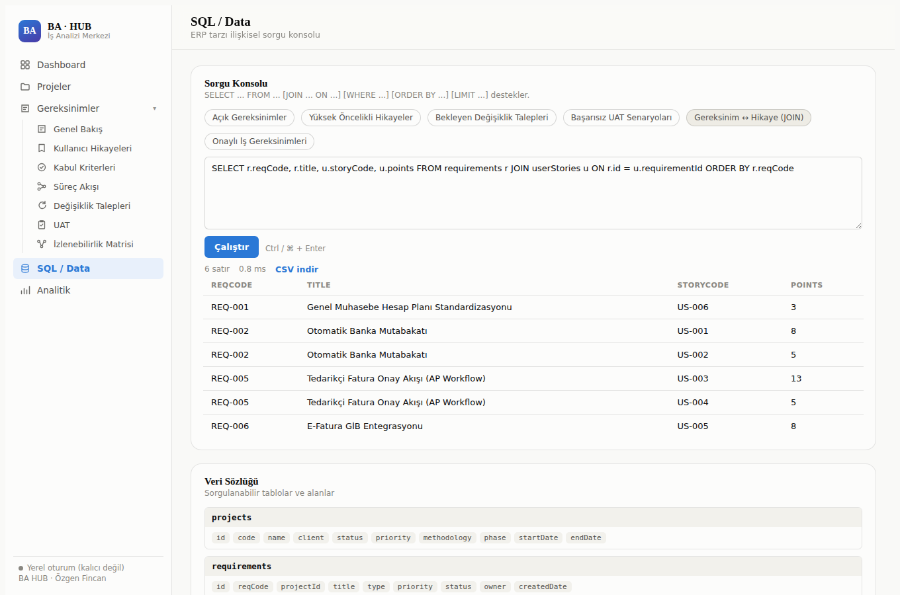
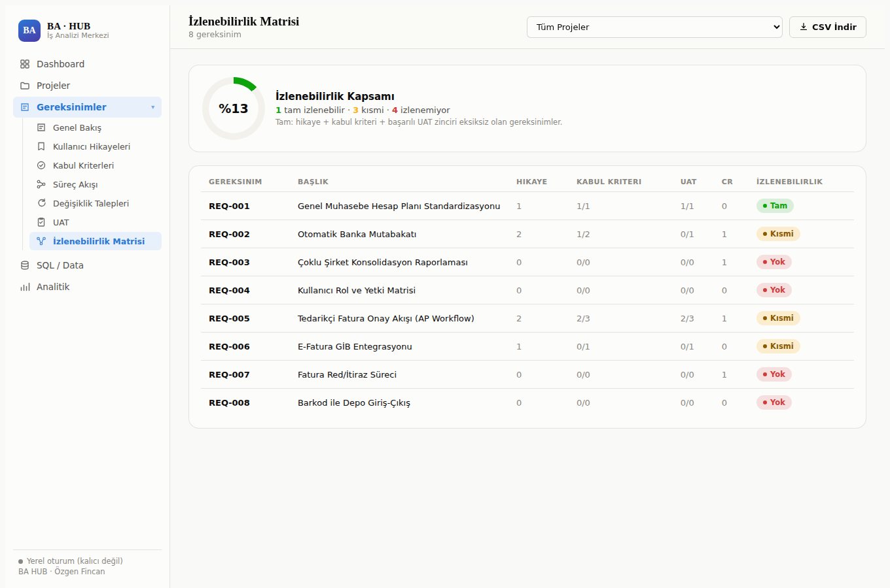
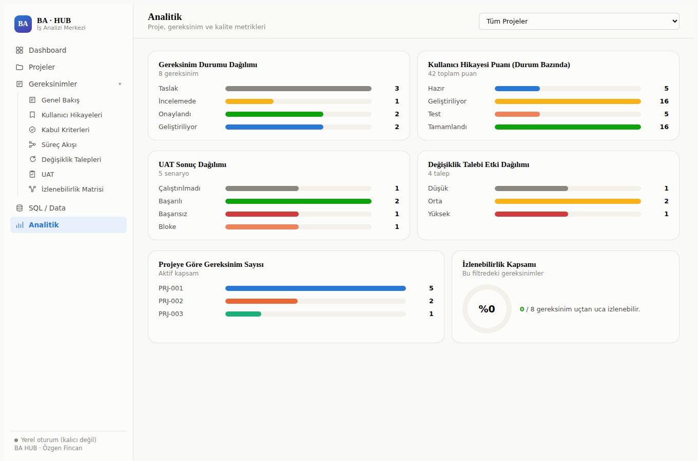
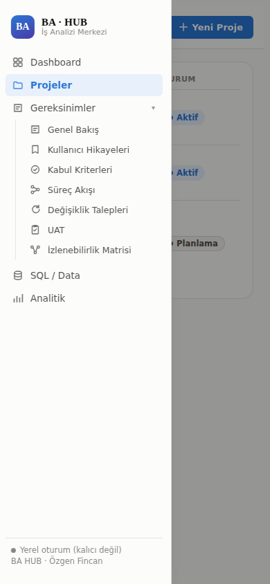

<div align="center">

# 🧭 BA Hub

**A self-built Business Analysis & Project Management workspace — Requirements, User Stories, Process Flows, Change Requests, UAT, Traceability, and a real SQL query console, in one tool.**
**Requirements, Kullanıcı Hikayeleri, Süreç Akışları, Değişiklik Talepleri, UAT, İzlenebilirlik Matrisi ve gerçek bir SQL sorgu konsolunu tek çatı altında toplayan, sıfırdan geliştirilmiş bir İş Analizi & Proje Yönetimi çalışma alanı.**

[🇹🇷 Türkçe](#-türkçe) · [🇬🇧 English](#-english) · [🔗 Live demo](https://claude.ai/artifact/B6xjZgp2KGszRsSUkpcYx3)

</div>

---

## 🇹🇷 Türkçe

### Bu proje ne?

**BA Hub**, bir iş analistinin gündelik iş akışını — gereksinim toplamadan kabul testine, süreç modellemeden veri sorgulamaya kadar — tek bir arayüzde birleştiren, sıfırdan tasarlanıp geliştirilmiş bir uygulamadır. Bu proje bir "todo app" klonu değil: gerçek bir ERP dönüşüm projesinin (SAP S/4HANA finans modülü, e-Fatura entegrasyonu, WMS iyileştirmesi) örnek verileriyle doldurulmuş, uçtan uca çalışan bir BA/PM aracıdır.

Amaç, sadece bir arayüz göstermek değil; bir iş analistinin **nasıl düşündüğünü** yazılıma dökmekti: gereksinimler nasıl parçalanır, kabul kriterleri nasıl yazılır, bir süreç akışında karar noktaları nasıl dallanır, izlenebilirlik nasıl ölçülür, değişiklik talepleri nasıl etki analiziyle değerlendirilir.

> 🔗 **Canlı, herkese açık demo:** https://claude.ai/artifact/B6xjZgp2KGszRsSUkpcYx3
> (Örnek verilerle dolu gelir, tamamen tıklanabilir/etkileşimlidir; ziyaretçi oturumu kapatınca değişiklikler sıfırlanır — bkz. [Neden iki sürüm var?](#neden-i̇ki-sürüm-var))

### Modüller

| Modül | Ne yapar |
|---|---|
| **Dashboard** | Tüm projeler genelinde KPI'lar (açık gereksinim, bekleyen CR, UAT başarı oranı), gereksinim durum dağılımı, izlenebilirlik kapsamı, son değişiklik talepleri |
| **Projeler** | Proje kaydı (kod, müşteri, sponsor, metodoloji, faz, tarihler) — tam CRUD |
| **Gereksinimler** | İş / fonksiyonel / fonksiyonel olmayan / teknik gereksinim kırılımı, öncelik ve durum takibi |
| **Kullanıcı Hikayeleri** | Klasik "As a / I want / So that" formatı, epic, story point, gereksinime bağlanma |
| **Kabul Kriterleri** | Given / When / Then formatında, hikayeye bağlı, doğrulama durumu |
| **Süreç Akışı** | Karar noktalarından çıkan Evet/Hayır dallarını otomatik yan yana çizen bir akış diyagramı editörü (bkz. [Teknik öne çıkanlar](#teknik-öne-çıkanlar)) |
| **Değişiklik Talepleri** | Etki analizi (Düşük/Orta/Yüksek), onay durumu, birden çok gereksinime bağlanabilme |
| **UAT** | Test senaryosu, adımlar, beklenen sonuç, Başarılı/Başarısız/Bloke/Çalıştırılmadı durumları |
| **İzlenebilirlik Matrisi** | Gereksinim → Hikaye → Kabul Kriteri → UAT zincirini otomatik hesaplayan, kapsam yüzdesi veren, CSV'ye aktarılabilen matris |
| **SQL / Data** | Tüm modüllerin verisi üzerinde gerçek `SELECT / WHERE / JOIN / ORDER BY / LIMIT` çalıştırabilen bir sorgu konsolu ve veri sözlüğü |
| **Analitik** | Durum/etki/puan dağılımları, proje bazlı kırılım, izlenebilirlik kapsam grafiği |

### Teknik öne çıkanlar

Bu, bir şablon veya no-code araçla değil; **sıfırdan, tek bir HTML dosyası içinde, çerçeve (framework) kullanmadan** yazılmış bir uygulamadır. Öne çıkan üç teknik parça:

1. **MiniSQL — sıfırdan yazılmış bir SQL motoru.** SQL/Data sekmesindeki sorgu konsolu, hazır bir kütüphaneye (örn. alasql) bağımlı olmak yerine el yazımı bir tokenizer + recursive-descent parser + execution engine ile çalışıyor. `SELECT`, `WHERE` (AND/OR/NOT, parantezli gruplama, `LIKE`, `IN`, `IS NULL`), `JOIN`/`LEFT JOIN`, `ORDER BY`, `LIMIT` destekliyor. 14 birim testle doğrulandı (bkz. `scripts/test-minisql.js` mantığı, aşağıda).
2. **Dallanan süreç akışı render algoritması.** Bir süreç adımı listesini (`{type, label, branch}`) tarayıp, ardışık "Evet"/"Hayır" dallarını otomatik olarak yan yana kolonlara ayıran ve tekrar tek kolona yakınsayan saf CSS tabanlı bir algoritma — SVG veya harici bir diyagram kütüphanesi kullanmıyor.
3. **İzlenebilirlik motoru.** Her gereksinim için hikaye → kabul kriteri → UAT → değişiklik talebi zincirini gezip "Tam / Kısmi / Yok" durumunu ve genel kapsam yüzdesini hesaplayan saf bir fonksiyon (`computeTraceability`).

### Mimari

- **Tek dosya, framework yok.** Vanilla JavaScript + CSS, ~108 KB, build adımı gerektirmiyor.
- **Kalıcılık: Claude Artifacts `db` capability'si.** Uygulama, Anthropic'in Artifact çalışma zamanının sunduğu doküman-tabanlı bulut veritabanına (`window.claude.use("db")`) bağlanıyor. 7 koleksiyon: `projects, requirements, userStories, acceptanceCriteria, changeRequests, uatCases, processFlows`. Bu servis mevcut değilse (örn. dosya doğrudan tarayıcıda açılırsa), uygulama otomatik olarak bellek-içi "yerel oturum" moduna düşüyor — arayüz aynı kalıyor, sadece kalıcılık kayboluyor.
- **Dışa aktarım: `downloads` capability'si.** İzlenebilirlik matrisi ve SQL sonuçları CSV olarak indirilebiliyor.
- **Tasarım sistemi.** Renk paleti, kontrast oranı ve renk körü güvenliği doğrulanmış (Delta-E tabanlı) bir palet kullanıyor; açık/koyu tema ve mobil genişlik (~390px) tam destekli.

### Neden iki sürüm var?

Claude Artifacts'ın canlı veritabanı özelliği (`db` capability), tasarım gereği **organizasyon içiyle sınırlı** — yani verinin kalıcı olduğu sürüm, sadece kendi Claude organizasyonumdaki kişilerle paylaşılabiliyor. Bu depoda paylaşılan `ba-hub.html`, dış dünyaya (işe alım uzmanları, GitHub ziyaretçileri) açık, herkese açık bağlantıyla çalışan **demo sürümüdür** — aynı kod, sadece kalıcı veritabanı bağlantısı olmadan çalışıyor; her ziyaretçi kendi oturumunda örnek verilerle tam etkileşimli bir deneyim yaşıyor.

### Test yaklaşımı

Kod tabanı üç katmanda doğrulandı:

1. **Birim testleri (Node.js)** — MiniSQL motorunun tokenizer/parser/execution katmanları için 14 test (SELECT, WHERE varyasyonları, JOIN/LEFT JOIN, ORDER BY, LIMIT, hata durumları).
2. **Uçtan uca "smoke test"** — sahte bir DOM üzerinde uygulamanın tamamı (~30 adım): her rotaya gezinme, her modülün oluştur/düzenle/sil akışı, süreç akışı editörü, tüm hazır SQL örnekleri, CSV dışa aktarım — hepsi otomatik olarak çalıştırılıp hata fırlatmadığı doğrulandı.
3. **Görsel doğrulama (Playwright + headless Chromium)** — uygulama gerçek bir tarayıcıda render edilip masaüstü/mobil genişlikte, açık/koyu temada ekran görüntüleri alındı. Bu adım, sahte-DOM testlerinin yakalayamadığı **iki gerçek hatayı** ortaya çıkardı ve düzeltildi: (1) SQL örnek sorgu butonlarının, metin kutusundaki eski sorguyu tekrar çalıştırması; (2) `MiniSQL` nesnesinin bazı çalışma zamanı bağlamlarında global scope'ta çözülememesi.

### Ekran görüntüleri

<table>
<tr>
<td width="50%"><br/><sub>Dashboard (açık tema)</sub></td>
<td width="50%"><br/><sub>Dashboard (koyu tema)</sub></td>
</tr>
<tr>
<td width="50%"><br/><sub>Süreç Akışı — otomatik dallanan karar diyagramı</sub></td>
<td width="50%"><br/><sub>SQL / Data — gerçek JOIN sorgusu çalıştırılıyor</sub></td>
</tr>
<tr>
<td width="50%"><br/><sub>İzlenebilirlik Matrisi ve kapsam yüzdesi</sub></td>
<td width="50%"><br/><sub>Analitik — durum/etki/puan dağılımları</sub></td>
</tr>
<tr>
<td width="50%"><br/><sub>Mobil menü</sub></td>
<td width="50%"></td>
</tr>
</table>

### Nasıl çalıştırılır

Bu proje bir Claude Artifact olarak yaşıyor, ama saf HTML/CSS/JS olduğu için başka yollarla da açılabilir:

- **Canlı demo:** yukarıdaki bağlantıya tıklamak yeterli.
- **Yerel olarak:** `ba-hub.html` dosyasını herhangi bir tarayıcıda doğrudan açın. Kalıcı veritabanı bağlanmayacağı için "yerel oturum" modunda, örnek verilerle çalışır.
- **Kendi Claude Artifact'ınız olarak:** dosya içeriğini bir Claude oturumunda Artifact olarak yayınlayıp `db` capability'sini tanımlarsanız kalıcı hale gelir.

### Veri modeli

```
projects            (kod, ad, müşteri, sponsor, durum, öncelik, metodoloji, faz, tarihler)
requirements         → projectId
userStories          → requirementId, projectId
acceptanceCriteria   → userStoryId, projectId
changeRequests       → projectId, relatedRequirementIds[]
uatCases             → userStoryId, projectId
processFlows         → projectId, steps[] ({type, label, branch})
```

### Nasıl geliştirildi

Bu uygulama, gereksinimlerin tanımlanmasından veri modeline, arayüz tasarımından test stratejisine kadar **Claude ile birlikte, iş analistliği ve proje yöneticiliği deneyimimin yönlendirdiği bir süreçte** geliştirildi: kapsam ve bilgi mimarisi elle çizildi, veri modeli ve iş kuralları (örn. izlenebilirlik hesaplama mantığı) uçtan uca tanımlandı, geliştirme sürecinde ortaya çıkan gerçek hatalar (yukarıda anlatılan SQL bug'ı gibi) test edilip düzeltildi. Amaç, hem bir BA/PM araç setini hem de yapay zeka destekli geliştirme sürecini iş analistliği disipliniyle nasıl yönettiğimi göstermekti.

### Sınırlamalar & sonraki adımlar

- Şu an tek kullanıcılı bir yetkilendirme modeli var (organizasyon içindeki herkes okuma/yazma yapabiliyor).
- Süreç akışı editörü, dallanan (branching) senaryoları destekliyor ama iç içe geçmiş (nested) dallanmaları desteklemiyor.
- Olası sonraki adımlar: rol bazlı yetkilendirme, dosya eki desteği, Gantt/zaman çizelgesi görünümü.

---

## 🇬🇧 English

### What is this?

**BA Hub** is a purpose-built Business Analysis & Project Management workspace, designed and built from the ground up rather than assembled from a template or no-code tool. It's not a to-do list clone — it's an end-to-end BA/PM tool pre-loaded with a realistic ERP transformation scenario (a SAP S/4HANA finance rollout, an e-invoice integration, a warehouse-management improvement project).

The goal wasn't just to ship a UI — it was to encode **how a business analyst actually thinks**: how requirements get decomposed, how acceptance criteria are written, how a process flow branches at a decision point, how traceability gets measured, how change requests get evaluated through impact analysis.

> 🔗 **Live public demo:** https://claude.ai/artifact/B6xjZgp2KGszRsSUkpcYx3
> (Ships pre-loaded with sample data, fully interactive; changes reset when a visitor's session ends — see [Why two versions?](#why-two-versions))

### Modules

| Module | What it does |
|---|---|
| **Dashboard** | Cross-project KPIs (open requirements, pending change requests, UAT pass rate), requirement status breakdown, traceability coverage, recent change requests |
| **Projects** | Project records (code, client, sponsor, methodology, phase, dates) — full CRUD |
| **Requirements** | Business / functional / non-functional / technical requirement breakdown, priority and status tracking |
| **User Stories** | Classic "As a / I want / So that" format, epics, story points, linked to a requirement |
| **Acceptance Criteria** | Given / When / Then format, linked to a story, with a verification status |
| **Process Flow** | A flow-diagram editor that automatically lays out Yes/No branches from a decision step side by side (see [Technical highlights](#technical-highlights)) |
| **Change Requests** | Impact analysis (Low/Medium/High), approval status, can link to multiple requirements |
| **UAT** | Test scenarios, steps, expected results, Pass/Fail/Blocked/Not-run statuses |
| **Traceability Matrix** | Auto-computed Requirement → Story → Acceptance Criteria → UAT chain, a coverage percentage, exportable to CSV |
| **SQL / Data** | A query console that runs real `SELECT / WHERE / JOIN / ORDER BY / LIMIT` against every module's data, plus a data dictionary |
| **Analytics** | Status/impact/points distributions, per-project breakdowns, a traceability coverage chart |

### Technical highlights

This wasn't built from a template or a no-code tool — it's a **single HTML file, hand-written, with no framework**. Three parts worth calling out:

1. **MiniSQL — a SQL engine built from scratch.** The SQL/Data console doesn't depend on a library (e.g. alasql) — it's a hand-written tokenizer + recursive-descent parser + execution engine. It supports `SELECT`, `WHERE` (AND/OR/NOT, parenthesized grouping, `LIKE`, `IN`, `IS NULL`), `JOIN`/`LEFT JOIN`, `ORDER BY`, `LIMIT`, and is covered by 14 unit tests.
2. **A branching process-flow renderer.** A pure-CSS algorithm that walks an ordered list of steps (`{type, label, branch}`), groups consecutive "Yes"/"No"-tagged steps into side-by-side columns, and reconverges them into a single column at the next unbranched step — no SVG, no diagramming library.
3. **A traceability engine.** A pure function (`computeTraceability`) that walks the Requirement → Story → Acceptance Criteria → UAT → Change Request chain for every requirement and derives a Full/Partial/None status plus an overall coverage percentage.

### Architecture

- **Single file, no framework.** Vanilla JavaScript + CSS, ~108 KB, no build step.
- **Persistence: the Claude Artifacts `db` capability.** The app talks to Anthropic's Artifact runtime's document-store (`window.claude.use("db")`) across 7 collections: `projects, requirements, userStories, acceptanceCriteria, changeRequests, uatCases, processFlows`. When that service isn't available (e.g. the file is opened directly in a browser), the app gracefully falls back to an in-memory "local session" mode — same UI, no persistence.
- **Export: the `downloads` capability.** The traceability matrix and SQL results can be exported as CSV.
- **Design system.** A validated (contrast-checked, color-blind-safe via Delta-E) palette; full light/dark theming and mobile support down to ~390px.

### Why two versions?

Claude Artifacts' live-database feature (the `db` capability) is, by design, **scoped to the owner's organization** — so the persistent version of this tool can only be shared with people inside my own Claude organization. The `ba-hub.html` shared in this repo is the **public demo build**: same code, just without the live-database connection, so it can be shared with anyone (recruiters, GitHub visitors) via a public link — each visitor gets a fully interactive session seeded with sample data.

### Testing approach

The codebase was verified at three layers:

1. **Unit tests (Node.js)** — 14 tests covering the MiniSQL engine's tokenizer, parser, and execution layers (SELECT variants, WHERE combinations, JOIN/LEFT JOIN, ORDER BY, LIMIT, error paths).
2. **End-to-end smoke test** — a ~30-step script running the entire app against a mock DOM: navigating every route, exercising create/edit/delete for every module, the process-flow step editor, every canned SQL example, and CSV export — all asserted not to throw.
3. **Visual verification (Playwright + headless Chromium)** — the app was rendered in a real browser and screenshotted at desktop/mobile widths in both themes. This step caught **two real bugs** the mock-DOM tests missed: (1) the SQL example-query chips re-running whatever was still in the textarea instead of the chip's own query; (2) the `MiniSQL` object failing to resolve on the global scope in certain runtime contexts.

### Screenshots

See the [Turkish section above](#ekran-görüntüleri) — same images, same captions in English: Dashboard (light/dark), Process Flow, SQL console, Traceability Matrix, Analytics, mobile nav.

### Running it

This project lives as a Claude Artifact, but since it's plain HTML/CSS/JS it can be opened other ways too:

- **Live demo:** just open the link above.
- **Locally:** open `ba-hub.html` directly in any browser. Since no live database is available, it runs in local-session mode with sample data.
- **As your own Claude Artifact:** publish the file's contents as an Artifact in a Claude session and declare the `db` capability to make it persistent.

### Data model

```
projects            (code, name, client, sponsor, status, priority, methodology, phase, dates)
requirements         → projectId
userStories          → requirementId, projectId
acceptanceCriteria   → userStoryId, projectId
changeRequests       → projectId, relatedRequirementIds[]
uatCases             → userStoryId, projectId
processFlows         → projectId, steps[] ({type, label, branch})
```

### How this was built

This app was built **with Claude, in a process driven by my own business-analysis and project-management background**: I defined the scope and information architecture, specified the data model and business rules (including the traceability-scoring logic), and drove the testing strategy that caught and fixed real bugs (like the SQL chip issue described above) during development. The point was to demonstrate both a BA/PM toolset and how I direct AI-assisted development with the discipline of a business analyst.

### Limitations & next steps

- Currently a single-tier authorization model (anyone inside the organization can read/write).
- The process-flow editor supports branching but not nested branches.
- Possible next steps: role-based access control, file-attachment support, a Gantt/timeline view.

---

<div align="center">

**Özgen Fincan** — Business Analyst / İş Analisti · Turanlar Group

</div>
